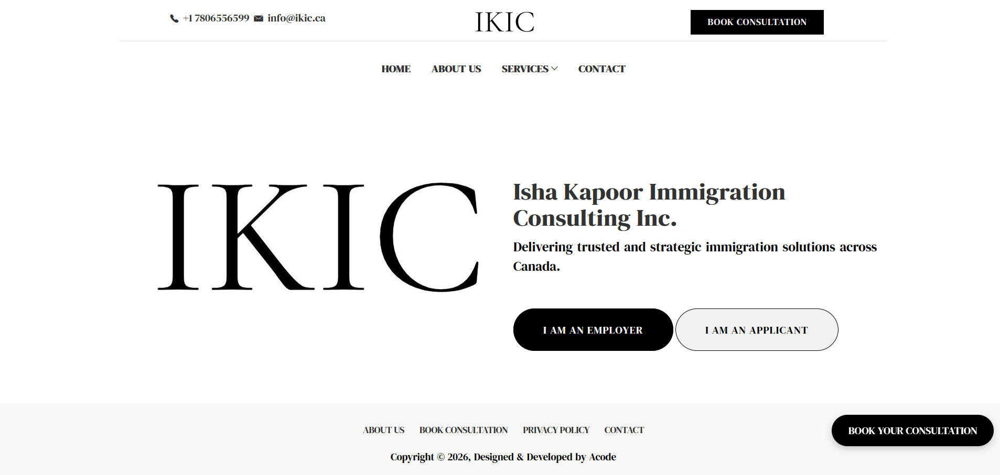
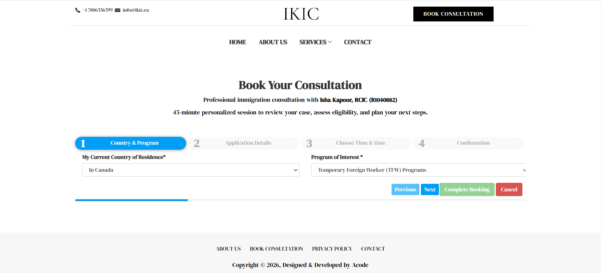
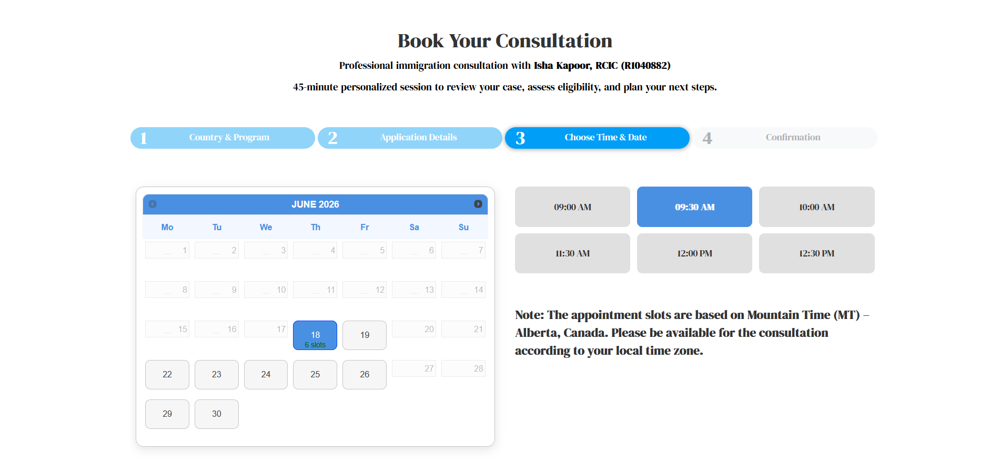
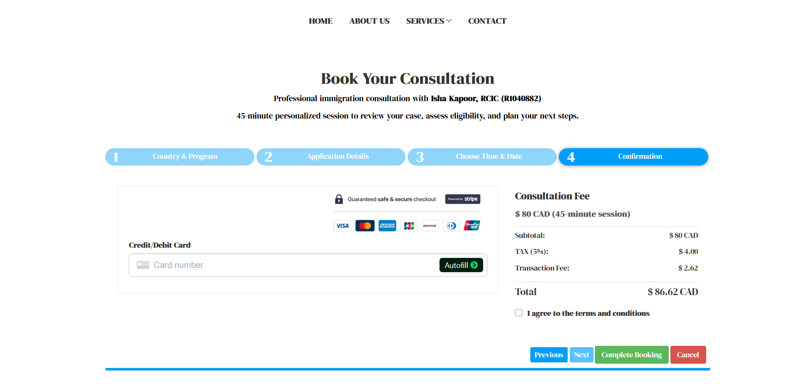

# Immigration Consultation Booking System

A full-stack consultation booking platform I developed for **Isha Kapoor Immigration Consulting Inc.** The system enables applicants and employers to book paid immigration consultation appointments through a multi-step wizard with Stripe payment integration, automated PDF invoicing, and email confirmations.

I originally built this as part of the company's development team, and later refactored the codebase with improved architecture, security hardening, and a service-layer pattern for my portfolio.

**Live:** [ikic.ca](https://ikic.ca)

---

## Screenshots

| Homepage | Booking Step 1 |
|----------|---------------|
|  |  |

| Booking Step 2 | Booking Step 3 |
|---------------|---------------|
|  |  |

---

## Architecture

```
├── application/
│   ├── config/           # Environment-driven configuration (DB, Stripe, Email, Routes)
│   ├── controllers/      # MVC controllers organized by domain
│   │   ├── Administrator/  # Admin dashboard (auth-protected)
│   │   │   ├── Applicant/  # Applicant appointment & schedule management
│   │   │   └── Employer/   # Employer appointment & schedule management
│   │   ├── Service/        # Service description pages (Applicant/Employer)
│   │   └── JSON/           # REST API endpoints
│   ├── core/             # MY_Controller (base), Admin_Controller (auth guard)
│   ├── libraries/        # Service layer
│   │   ├── Payment_service.php   # Stripe payment processing
│   │   ├── Booking_service.php   # Slot management & availability
│   │   ├── Email_service.php     # SMTP email with HTML templates
│   │   ├── Invoice_service.php   # PDF invoice generation (Dompdf)
│   │   └── Timezone_service.php  # Mountain Time conversion
│   ├── models/           # Data access layer with base model inheritance
│   ├── migrations/       # Version-controlled database schema
│   └── views/            # Blade-style PHP templates
├── resources/            # Frontend assets (CSS, JS, plugins)
├── email_templates/      # HTML email templates
└── uploads/              # Generated invoice PDFs
```

## Tech Stack

| Layer       | Technology                                       |
|-------------|--------------------------------------------------|
| Backend     | PHP 7.4+, CodeIgniter 3.x                       |
| Database    | MySQL / MariaDB (via MySQLi driver)              |
| Payments    | Stripe API (PaymentIntent flow)                  |
| PDF         | Dompdf (invoice generation)                      |
| Email       | SMTP via CodeIgniter Email Library                |
| Frontend    | Bootstrap 3, jQuery, SmartWizard                 |
| Maps        | Google Maps JavaScript API                        |
| Server      | Apache with mod_rewrite                          |

## Key Features

- **Multi-step booking wizard** — 4 steps for applicants (country, program, schedule, payment), 3 steps for employers
- **Stripe payment processing** — Secure PaymentIntent API with automatic payment methods
- **PDF invoice generation** — Auto-generated INV-XXXXX invoices attached to confirmation emails
- **Timezone-aware scheduling** — Slots managed in Mountain Time (Alberta, Canada) with client-side conversion
- **Admin dashboard** — Appointment management, slot creation/deletion, status updates
- **Dual user flows** — Separate booking paths for immigration applicants and employers
- **Cron-based slot cleanup** — Automated removal of past time slots with token-based auth
- **CSRF protection** — Enabled on all forms with configurable endpoint exclusions
- **Database transactions** — Atomic booking operations prevent double-booking race conditions

## Security

- All secrets (Stripe keys, SMTP credentials, DB passwords) stored in `.env` (never committed)
- Admin passwords hashed with `bcrypt` via `password_hash()` / `password_verify()`
- CSRF token protection on all POST forms
- Input validation on all user-submitted data
- Security headers (X-Content-Type-Options, X-Frame-Options, X-XSS-Protection)
- Environment-based error reporting (errors hidden in production)
- Cron endpoints protected by auth token
- Session regeneration on login to prevent fixation attacks

## Setup

### Prerequisites
- PHP 7.4+ with `mysqli`, `mbstring`, `gd`, `openssl` extensions
- MySQL 5.7+ or MariaDB 10.3+
- Composer (for development dependencies)

### Installation

```bash
# 1. Clone the repository
git clone <repo-url> consultation-booking
cd consultation-booking

# 2. Create environment file
cp .env.example .env
# Edit .env with your database, Stripe, and SMTP credentials

# 3. Set up the database (creates tables + seed data)
mysql -u root -p < database/setup.sql

# 4. Start the development server
php -S localhost:8000 server.php
# Or on Windows, just double-click: serve.bat

# 5. Open http://localhost:8000 in your browser
```

### Running with XAMPP (alternative)

If you prefer Apache via XAMPP, place the project in `htdocs/` and set `BASE_URL=https://localhost/consultation-booking/` in your `.env` file.

### Environment Variables

See [.env.example](.env.example) for all required variables:
- `CI_ENV` — Application environment (`development` / `production`)
- `DB_*` — Database connection settings
- `STRIPE_*` — Stripe API keys and payment amount
- `SMTP_*` — Email server credentials
- `CRON_AUTH_TOKEN` — Token for cron endpoint authentication

## API Endpoints

| Method | Endpoint                     | Description                      |
|--------|------------------------------|----------------------------------|
| POST   | `/api/applicant/payment`     | Process applicant Stripe payment |
| POST   | `/api/applicant/schedules`   | Get slots for a specific date    |
| GET    | `/api/applicant/slots`       | Get all available slots          |
| POST   | `/api/employer/save`         | Submit employer booking          |
| POST   | `/api/employer/schedules`    | Get employer slots for a date    |
| POST   | `/api/contact`               | Send contact form message        |
| POST   | `/api/timezone/slots`        | Convert slots to target timezone |

## Admin Routes

All admin routes are prefixed with `/admin` and require session authentication:

| Route                               | Description                    |
|--------------------------------------|-------------------------------|
| `/admin`                             | Dashboard                     |
| `/admin/login`                       | Login page                    |
| `/admin/applicant/appointments`      | Manage applicant appointments |
| `/admin/applicant/schedule`          | Manage applicant time slots   |
| `/admin/employer/appointments`       | Manage employer appointments  |
| `/admin/employer/schedule`           | Manage employer time slots    |

---

Developed by **Prince Mathew** — [mathewprincech@gmail.com](mailto:mathewprincech@gmail.com)
